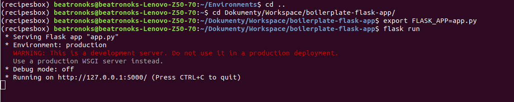

# Boilerplate for Python Flask App from Scratch in Ubuntu 18.04

Boilerplate how to get started using the Flask framework (to-do)
- [x] create new virtual env and install the necessary packages and get a basic Hello World Application running in our browser. 
- [ ] add templates
- [ ] prepare HTML for application
- [ ] adding styling


## 1. Creating virtual environment for new project.

Virtual Environments in Python allow us to keep project-specific dependencies in a separate place than our global site-packages. This is extremely useful when you have different versions of packages for different projects.


##### Folder to keep all environments on my computer:

```
/Environments
```

##### 1.1 To create new env: 

```
virtualenv {nameOfProject}
```

In case, when you want create new, virtual env with specific version of Python:

```
virtualenv -p /usr/bin/python2.6 {nameOfProject}
```

##### 1.2. Activate Python env:

```
source {nameOfNewProject}/bin/activate
```

##### 1.3. Install new packages into local env:


```
pip install {nameOfPackage}

pip install flask
```

If you want to go back to being in the global env:

```
deactivate
```
Prompt with name of project no longer shows up.


If you want delete virtual env:

```
rm -rf {nameOfProject}
```

To enlist all packages:


```
pip list
```

You can also use your global site packahes within virtual Python environment.

Freezing is a process where pip reads the versions of all installed packages in a local virtual environment and then produces a text file with the package version for each python package specified. By convention, it's named requirements. txt .

```
pip freeze --local >environment.txt
```

To make sure you got all packages:

```
cat environment.txt
```

You get list of all packages with versions.


In case, you want install those packages from environment.txt in next project:

```
pip install -r requirements.txt
```


## 2. Creating app.py 

Create new folder for your application and file app.py, starting with example from the documentation:

```
from flask import Flask, escape, request

app = Flask(__name__)

@app.route('/')
def hello():
    name = request.args.get("name", "World")
    return f'Hello, {escape(name)}!'

```

##### 2.1. Join virtual environment with Python app's file:

Before running application you need to set an environment variable to the file, that you want to be flask application.

In line command of your virtual Python environment go to your project's folder and type in:

```
export FLASK_APP=app.py

```



On the port 5000 it will show Hello world.

Run your application in debug mode to make the server to show changes without restarting. To close, hit ctr + c and set up another env:

```
export FLASK_DEBUG=1

```
After that, run again flask app

```
flask run

```


Changes should be showed automatically.

Another way to do this, is putting a conditional in app.py:

```
if __name__ == '__main__':
  app.run(debug=True)

```
##### 2.2. Add routes:

```
@app.route('/')
@app.route('/home')
def home():
    return "<h1>Home Page</h1>"

```
##### 2.2. Render template from templates folder:

To render a template you can use the render_template() method. All you have to do is provide the name of the template and the variables you want to pass to the template engine as keyword arguments. Here’s a simple example of how to render a template:

```
from flask import render_template

@app.route('/hello/')
@app.route('/hello/<name>')
def hello(name=None):
    return render_template('hello.html', name=name)

```

Flask will look for templates in the templates folder. So if your application is a module, this folder is next to that module, if it’s a package it’s actually inside your package:

```
<!doctype html>
<title>Hello from Flask</title>

  <h1>Hello {{ name }}!</h1>

  <h1>Hello, World!</h1>

```