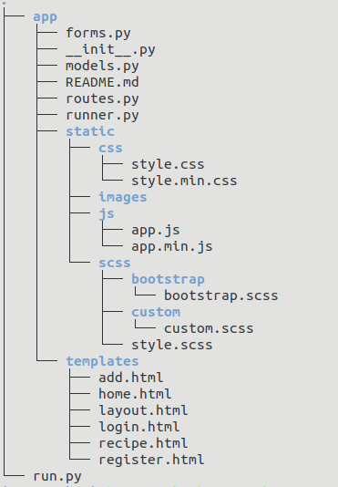

# Step by step for Python Flask App from Scratch

Boilerplate how to get started using the Flask framework. 
- [x] create new virtual env and install the necessary packages and get a basic Hello World Application running in our browser. 
- [x] create register and login form using wtforms
- [x] adding styling(used sass pre-processor - libsass)
- [ ] database with Flask-SQLAlchemy
- [ ] user authentication
- [ ] creating user account with uploading the picture
- [ ] adding pagination
- [ ] creating custom error pages
- [ ] deployment

## 1. Creating virtual environment for new project.

Virtual Environments in Python allow us to keep project-specific dependencies in a separate place than our global site-packages. This is extremely useful when you have different versions of packages for different projects.


##### Folder to keep all environments on my computer:

```
/Environments
```

##### 1.1 To create new env: 

```
virtualenv {nameOfProject}
```

In case, when you want create new, virtual env with specific version of Python:

```
virtualenv -p /usr/bin/python2.6 {nameOfProject}
```

##### 1.2. Activate Python env:

```
source {nameOfNewProject}/bin/activate
```

##### 1.3. Install new packages into local env:


```
pip install {nameOfPackage}

pip install flask
```

If you want to go back to being in the global env:

```
deactivate
```
Prompt with name of project no longer shows up.


If you want delete virtual env:

```
rm -rf {nameOfProject}
```

To enlist all packages:


```
pip list
```

You can also use your global site packages within virtual Python environment.

Freezing is a process where pip reads the versions of all installed packages in a local virtual environment and then produces a text file with the package version for each python package specified. By convention, it's named requirements. txt .

```
pip freeze --local >environment.txt
```

To make sure you got all packages:

```
cat environment.txt
```

You get list of all packages with versions.


In case, you want install those packages from environment.txt in next project:

```
pip install -r requirements.txt
```


## 2. Creating app.py 

Create new folder for your application and file app.py, starting with example from the documentation:

```
from flask import Flask, escape, request

app = Flask(__name__)

@app.route('/')
def hello():
    name = request.args.get("name", "World")
    return f'Hello, {escape(name)}!'

```

##### 2.1. Join virtual environment with Python app's file:

Before running application you need to set an environment variable to the file, that you want to be flask application.

In line command of your virtual Python environment go to your project's folder and type in:

```
export FLASK_APP=app.py

```


On the port 5000 it will show Hello world.


## 3.Forms and User Input.

```
pip install flask-wtf

```

Create files: register.html and login.html.
Build new forms according to documentation using packages below:

- wtforms,
- flash,
- url_for,
- redirect


## 3.Styling with pre-processors SASS.

In the virtual env install new packages:

```
pip install rcssmin rjsmin sass
```
Using these 3 packages:
    - Compiles scss to css
    - Minifies css
    - Minifies JavaScript

In new script runner.py:

```

sass_map = {"app/static/scss/style.scss": "app/static/css/style.css"}


css_map = {"app/static/css/style.css": "app/static/css/style.min.css"}


js_map = {"app/static/js/app.js": "app/static/js/app.min.js"}


def compile_sass_to_css(sass_map):

    print("Compiling scss to css:")

    for source, dest in sass_map.items():
        with open(dest, "w") as outfile:
            outfile.write(sass.compile(filename=source))
        print(f"{source} compiled to {dest}")


def minify_css(css_map):

    print("Minifying css files:")

    for source, dest in css_map.items():
        with open(source, "r") as infile:
            with open(dest, "w") as outfile:
                outfile.write(rcssmin.cssmin(infile.read()))
        print(f"{source} minified to {dest}")


def minify_javascript(js_map):

    print("Minifying JavaScript files:")

    for source, dest in js_map.items():
        with open(source, "r") as infile:
            with open(dest, "w") as outfile:
                outfile.write(rjsmin.jsmin(infile.read()))
        print(f"{source} minified to {dest}")

```

Add to app.py:

```
  <link rel="stylesheet" href="{{ url_for('static', filename='css/style.min.css') }}">
```

## 4. Creating database with flask-SQLAlchemy.


install new package in virtual env:

``` 
pip install flask-sqlalchemy
```
and import into application. After that, choose location of database and create database instance:

```
app.config['SQLALCHEMY_DATABASE_URI'] = 'sqlite:///site.db'

db = SQLAlchemy(app)
```

After creating tables, import database from application file:

```
$ python

>>> from app import db
>>> db.create_all()
>>> from app import User, Recipe
```

After that, create user and add into a database:

```
>>> user_1 = User(username='user', email='user@gmail.com', password='password')
>>> db.session.add(user_1)

```

